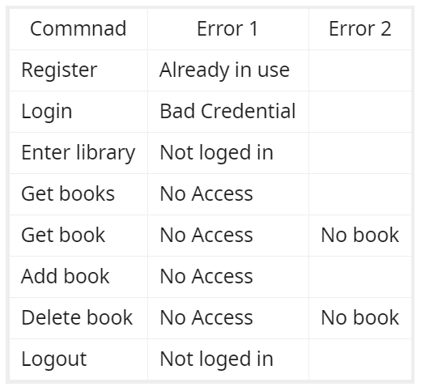
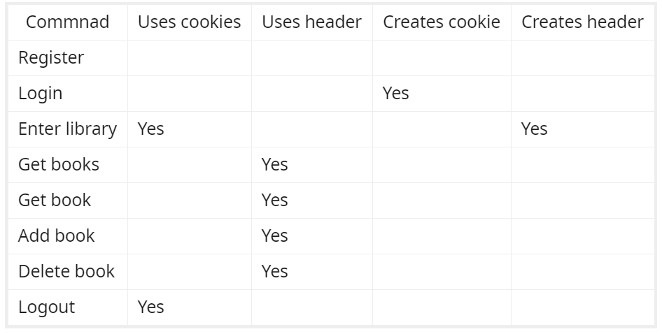

# Online Library Client

This is HTTP client that work with a REST API

# Usage

Comands:
* exit
* register
* login
* enter_library
* get_books
* get_book
* add_book
* delete_book
* logout
Examples of usage
```
enter_library
get_books

1 Book1
2 Book2

get_book 1
Title		Book1
Author		The first writer
Page count	10
Genre		Lorem Ipsum
Publisher	Lorem Ipsum Editure

delete_book 2
Successfull delete

delete_book 2
No book was deleted!

get_book 2
Error during get_book

```
# Implementation

Choosen library : parson.h
* Lightweight
* Full JSON support

Types of request used :
* GET
* POST
* DELETE

Commands and what errors they signal

The client stores the cookies it got and the last JWT-token it has received



Commnads and their interaction with cookies and headers


